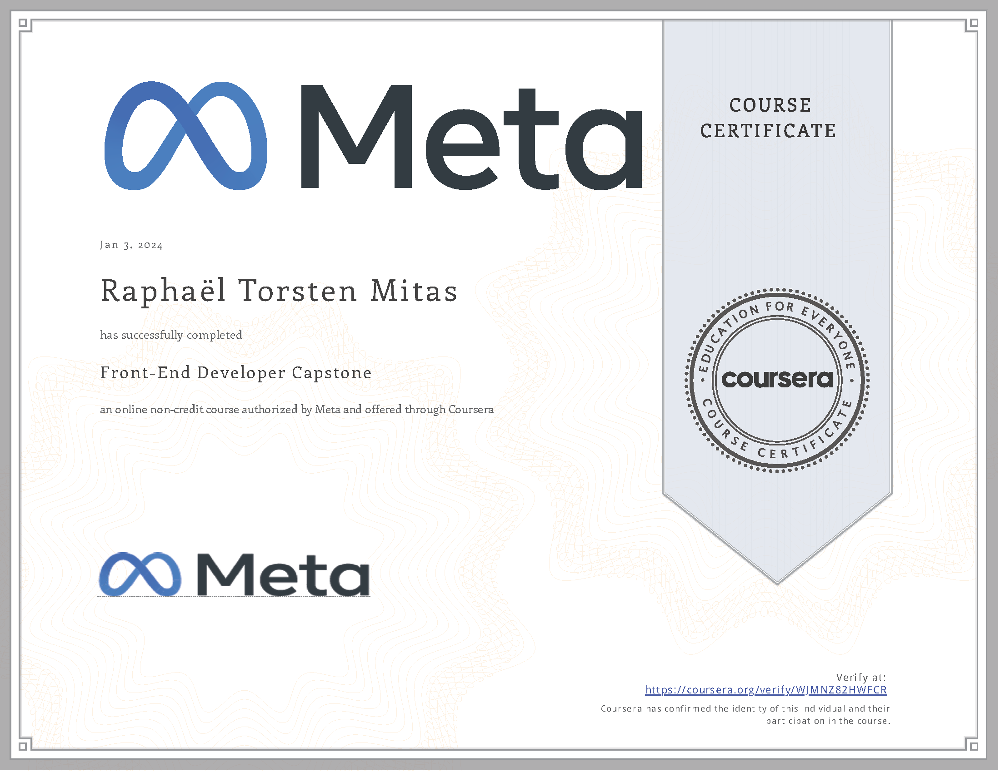

# Meta Front-End Developer Capstone Project

## Certificate

## About This Project

This project, part of the Meta Front-End Developer Professional Certificate, showcases a responsive User Interface (UI) using React JS and JavaScript, highlighting my skills in web development.

## Key Technologies

- **React JS (Create React App)**
- **Figma**
- **Material-UI (MUI)**
- **Formik**

## How to Install and Run

1. Clone the repository: `git clone https://github.com/RaphaelMitas/meta-capstone-project.git`
2. Navigate to the project directory: `cd meta-capstone-project`
3. Install dependencies: `npm install`
4. Run the application: `npm start`
5. Open `http://localhost:3000` in your browser to view the app.

## Project Site

Visit the deployed project at [meta-capstone-project.raphaelmitas.com](https://meta-capstone-project.raphaelmitas.com/).
